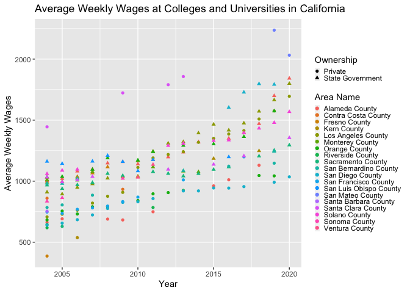

```r
if (!file.exists("Quarterly_Census_of_Employment_and_Wages__QCEW_.csv"))
  download.file(
    url = "https://data.edd.ca.gov/api/views/fisq-v939/rows.csv?accessType=DOWNLOAD",
    destfile = "Quarterly_Census_of_Employment_and_Wages__QCEW_.csv",
    method   = "libcurl",
    timeout  = 60
    )
input <- data.table::fread("Quarterly_Census_of_Employment_and_Wages__QCEW_.csv")
```

#Introduction
An issue that I have seen being constantly spoken about is the economy and the rise of inflation. Being a student in the science field, I have very little background on economics; frankly, the last time I took a course in economics was in high school. I was interested in examining wage disparities, more specifically throughout California and within the education sector, as this is the area I'm currently working in.

#### The question that I will be exploring is:
#### How have wages throughout California, especially within the education sector, changed from 2004 until 2021?

# Methods
The dataset I used is California's Quarterly Census of Employment and Wages from data.gov (web address: https://catalog.data.gov/dataset/quarterly-census-of-employment-and-wages-qcew). It contains average weekly wages for various industries from 2004 to 2021, also categorized by county and ownership (state government, local government, private).

This dataset is quite large (531.5 MB), so I cleaned the data with a number of steps:
1. I filtered the dataset to only include average annual wages. This dataset has a column named *quarter*, which subdivides the data per each quarter (1st through 4th) as well as the annual values. In order to control for fluctuations throughout the year, I used the annual values for the subsequent steps. I also omitted any nationwide observations to focus on California-specific values only.
2. There were triplicate repeats of each entry based on variations in the NAICS (North American Industry Classification System) code entry. These were removed so that there were fewer observations.
3. A smaller dataset (*education*) was made by subsetting the dataset by NAICS code values that begin with 61, which is the code for Education Services (https://www.naics.com/search/).

The graphs in this report were made using the ggplot2 package.

#### Dependencies / Packages Used:
* data.table
* tidytext
* ggplot2
* dplyr
* tibble
* forcats
* tidyr
* tidyverse


```r
#step 1
input <- filter(input, Quarter == "Annual")
input <- filter(input, `Area Type` != "United States")
input = subset(input, select = -c(`1st Month Emp`,`2nd Month Emp`, `3rd Month Emp`) )
#step 2
input[, n := 1:.N, by = .(Establishments, `Average Weekly Wages`)]
input <- input[n == 1,][, n := NULL]
#step 3
education <- input %>% filter(str_detect(`NAICS Code`, '^61'))
```

# Results
##change for 2020??

### 1. Which industries have the highest and lowest wages?
To do this, I first searched for the top average weekly wage for each unique industry overall, counting through all counties and all years contained in this dataset. The top and bottom five industries are listed below.


```r
industries <- input[, .(
  Average_Weekly_Wages = mean(`Average Weekly Wages`, na.rm =TRUE),
  year = Year,
  county = `Area Name`), by = .(`Industry Name`)
]
industries <- distinct(industries, `Industry Name`, .keep_all = TRUE)
industries[order(-industries$Average_Weekly_Wages), ] %>% head(5)
```

```
##                                                           Industry Name
## 1:                                               Sports Teams and Clubs
## 2:                                            Open-End Investment Funds
## 3:                                         Miscellaneous Intermediation
## 4: Research and Development in Biotechnology (except Nanobiotechnology)
## 5:                              Investment Banking & Securities Dealing
##    Average_Weekly_Wages year         county
## 1:             4973.694 2004 Alameda County
## 2:             4517.464 2004 Alameda County
## 3:             3837.284 2004 Alameda County
## 4:             3694.469 2017 Alameda County
## 5:             3650.582 2004 Alameda County
```

```r
topindustries <- input %>% group_by(`Industry Name`) %>% top_n(1, `Average Weekly Wages`)
topindustries[order(-topindustries$`Average Weekly Wages`), ] %>% head(5) %>% select(`Industry Name`, `Year`, `Average Weekly Wages`) %>% knitr::kable(caption = "5 Industries with the Highest Average Weekly Wages")
```


Table: 5 Industries with the Highest Average Weekly Wages

|Industry Name                                 | Year| Average Weekly Wages|
|:---------------------------------------------|----:|--------------------:|
|Computers and Peripheral Equipment            | 2012|                32829|
|Computer Systems Design Services              | 2012|                26125|
|Media Buying Agencies                         | 2017|                25244|
|Internet Publishing, Broadcasting, Web Search | 2013|                23075|
|Other Information Services                    | 2013|                22907|

```r
bottomindustries <- input[`Average Weekly Wages` != 0] %>% group_by(`Industry Name`) %>% top_n(-1, `Average Weekly Wages`)
bottomindustries[order(bottomindustries$`Average Weekly Wages`), ] %>% head(5) %>% select(`Industry Name`, `Year`, `Average Weekly Wages`) %>% knitr::kable(caption = "5 Industries with the Lowest Average Weekly Wages")
```


Table: 5 Industries with the Lowest Average Weekly Wages

|Industry Name                            | Year| Average Weekly Wages|
|:----------------------------------------|----:|--------------------:|
|Justice, Public Order, and Safety Activi | 2017|                    9|
|Unclassified                             | 2008|                   11|
|Other Hospitals                          | 2019|                   18|
|International Affairs                    | 2011|                   20|
|Utility Regulation and Administration    | 2011|                   24|

### 2. Which counties have the highest and lowest average weekly wages?
I first filtered the input dataset to contain the top average weekly wage per county. The top and bottom five counties are listed below, as well as which industry within that county this average weekly wage corresponds to. 


```r
topcounties <- input %>% group_by(`Area Name`) %>% top_n(1, `Average Weekly Wages`)
topcounties[order(-topcounties$`Average Weekly Wages`), ] %>% head(5) %>% select(`Area Name`, `Industry Name`, `Year`, `Average Weekly Wages`) %>% knitr::kable(caption = "5 Counties with the Highest Average Weekly Wages")
```


Table: 5 Counties with the Highest Average Weekly Wages

|Area Name            |Industry Name                           | Year| Average Weekly Wages|
|:--------------------|:---------------------------------------|----:|--------------------:|
|Santa Cruz County    |Computers and Peripheral Equipment      | 2012|                32829|
|San Mateo County     |Computer Systems Design Services        | 2012|                26125|
|Los Angeles County   |All Other Information Services          | 2017|                16136|
|Napa County          |Other Activities Related to Real Estate | 2014|                15178|
|San Francisco County |Chemical Manufacturing                  | 2016|                14396|

```r
topcounties[order(topcounties$`Average Weekly Wages`), ] %>% head(5) %>% select(`Area Name`, `Industry Name`, `Year`, `Average Weekly Wages`) %>% knitr::kable(caption = "5 Counties with the Lowest Average Weekly Wages")
```


Table: 5 Counties with the Lowest Average Weekly Wages

|Area Name      |Industry Name                        | Year| Average Weekly Wages|
|:--------------|:------------------------------------|----:|--------------------:|
|Modoc County   |Finance and Insurance                | 2018|                 1771|
|Sierra County  |Unclassified                         | 2010|                 2221|
|Glenn County   |Office Administrative Services       | 2016|                 2336|
|Amador County  |Custom Computer Programming Services | 2011|                 2492|
|Trinity County |Unclassified                         | 2010|                 2529|

### 3. Which education sectors have the highest and lowest weekly wages?
I filtered the dataset to the top average weekly wages per industry. The top and bottom five are listed below.

```r
topedsector <- education %>% group_by(`Industry Name`) %>% top_n(1, `Average Weekly Wages`)
topedsector[order(-topedsector$`Average Weekly Wages`), ] %>% head(5) %>% select(`Area Name`, `Industry Name`, `Year`, `Average Weekly Wages`) %>% knitr::kable(caption = "5 Education Sectors with the Highest Average Weekly Wages")
```


Table: 5 Education Sectors with the Highest Average Weekly Wages

|Area Name              |Industry Name                | Year| Average Weekly Wages|
|:----------------------|:----------------------------|----:|--------------------:|
|California             |Colleges and Universities    | 2019|                 3638|
|Sacramento County      |Computer Training            | 2017|                 2981|
|Sonoma County          |Educational Support Services | 2020|                 2890|
|Solano County          |Flight Training              | 2020|                 2591|
|San Luis Obispo County |Management Training          | 2016|                 2587|
The *Colleges and Universities* industry had the highest average weekly wage out of all the industries within the *education* sector. This makes sense to me given that this category likely encompasses universities with large endowments and high-salaried employees such as coaches and the board of directors.

### 4. Within the *Colleges and Universities* sector, how much have salaries grown over the last decade?

Not surprisingly, the outliers with the highest weekly wages in 2004, 2009, 2012, 2013, 2019 and 2020 come from privately owned colleges and universities in San Mateo County and Santa Clara County. In 2020, San Mateo County, Alameda County, and Los Angeles County have the highest wages. This is likely due to the cost of living in these areas being among the highest in the state.

```r
colluniv <- filter(education, `Industry Name` == "Colleges and Universities")
colluniv[`Area Name` != "California"] %>% ggplot() +
  geom_point(mapping=aes(x=Year, y = `Average Weekly Wages`, group = `Area Name`, color=`Area Name`, shape = Ownership)) +
  labs(title = "Average Weekly Wages at Colleges and Universities in California", x  = "Year", y = "Average Weekly Wages") +
  theme(legend.key.size = unit(0.2,"cm"), legend.spacing = unit(0.1,"cm"))
```

<!-- -->

```r
#legend.text = element_text(size = 6)
```


```r
#la_education <- filter(la_education, Quarter == "Annual")
#summary(la_education$`Average Monthly Employment`)
#summary(la_education$`Average Weekly Wages`)
#la <- input[`Area Name` == "Los Angeles County"]
#unique(la$Year)
#la_education <- la %>% filter(str_detect(`Industry Name`, 'Education|education|teaching|school|School|Teaching|academ|Academ|institute|Institute|College|college|university|University'))
#unique(la_education$`Industry Name`)
#input[, n := 1:.N, by = .(Establishments, `Average Weekly Wages`)]
#input <- input[n == 1,][, n := NULL]
#education <- input %>% filter(str_extract_all(input$`NAICS Code`, "61*"))
```

```r
#la_education[`Industry Name` == "Colleges and Universities"] %>%
#  ggplot(mapping = aes(x = Year, y = `Average Weekly Wages`, group = Year)) +
#  geom_bar(position = 'dodge', stat = 'identity')
#ggplot(la_education, mapping=aes(x=COUNTY, y = PM2.5, group = year)) +
#  geom_bar(mapping=aes(fill=year),stat='identity', position='dodge') +
#  labs(title = "Mean PM2.5 Concentrations per County", y = "Average PM2.5 Concentration") +
#theme(axis.text.x = element_text(angle = 90, vjust = 0.5, hjust=1))
```

```r
#wage_pc <- function(x) {
#  x <- x[order(x$Year, decreasing = TRUE), ]
#  pc <- -diff(x$`Average Weekly Wages`)/(x$`Average Weekly Wages`)[-1] *100
#  data.frame(year = x$Year[-length(x$Year)], percent_change = pc)
#}
#la_coluniv <- filter(la_education, `Industry Name` == "Colleges and Universities")
##Get rid of duplicate rows
#la_coluniv[, n := 1:.N, by = .(Establishments, `Average Weekly Wages`)]
#la_coluniv <- la_coluniv[n == 1,][, n := NULL]
#la_education[, n := 1:.N, by = .(Establishments, `Average Weekly Wages`)]
#la_education <- la_education[n == 1,][, n := NULL]
#la[, n := 1:.N, by = .(Establishments, `Average Weekly Wages`)]
#la <- la[n == 1,][, n := NULL]

#la_coluniv_pc <- la_coluniv %>% 
#  group_by(Ownership) %>%
#  do(wage_pc(.))
```


